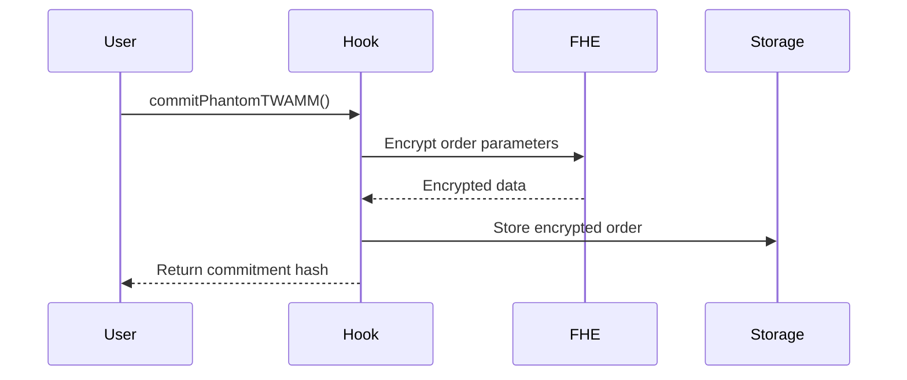
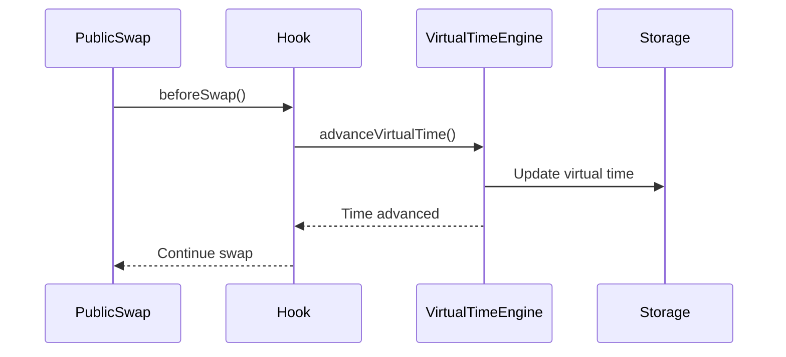
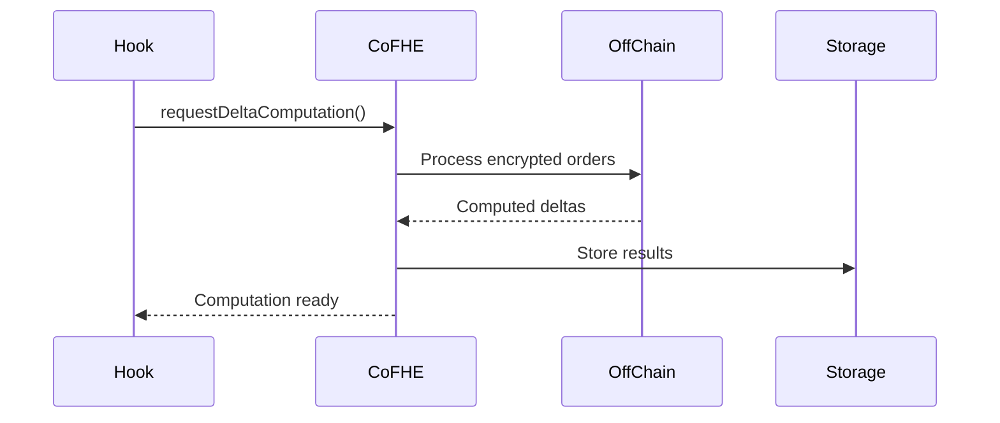
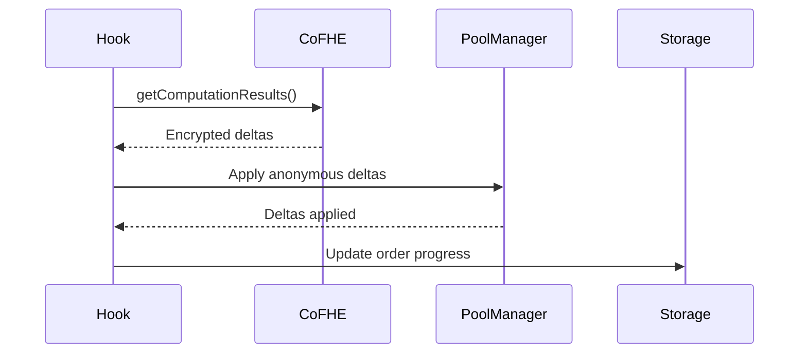

# PhantomTWAMM Architecture Guide

## Overview

PhantomTWAMM is a Uniswap V4 hook that enables private, time-weighted order execution using Fully Homomorphic Encryption (FHE). This document provides a detailed technical architecture overview.

## System Architecture

### Core Components

#### 1. PhantomTWAMM.sol - Main Hook Contract

The main hook contract that integrates with Uniswap V4's hook system.

**Key Features:**
- Implements `BaseHook` interface
- Manages encrypted order storage
- Handles virtual time advancement
- Coordinates CoFHE integration
- Provides optional reveal functionality

**Hook Permissions:**
- `afterInitialize`: Initialize FHE infrastructure for new pools
- `beforeSwap`: Process phantom orders and advance virtual time

#### 2. VirtualTimeEngine.sol - Time Management

Manages encrypted virtual time progression for each pool.

**Key Functions:**
- `advanceVirtualTime()`: Advance pool's virtual time
- `getVirtualTimeProgress()`: Calculate execution progress
- `calculateExecutionRate()`: Determine execution rate
- `isOrderComplete()`: Check if order is fully executed

#### 3. EncryptedDeltaCalculator.sol - CoFHE Integration

Handles off-chain computation of encrypted deltas using CoFHE.

**Key Functions:**
- `requestDeltaComputation()`: Request CoFHE computation
- `applyAnonymousDeltas()`: Apply computed deltas
- `aggregateOrderDeltas()`: Bundle multiple order deltas
- `simulateCoFHEComputation()`: Demo simulation

#### 4. UnlinkableCommitments.sol - Privacy Layer

Creates and manages unlinkable order commitments.

**Key Functions:**
- `generateCommitment()`: Create unlinkable commitment
- `verifyCommitment()`: Verify commitment validity
- `createPrivacyEnhancedCommitment()`: Enhanced privacy features
- `generateNullifier()`: Prevent double-spending

#### 5. OptionalRevealManager.sol - Audit System

Manages optional post-settlement reveals for compliance.

**Key Functions:**
- `revealForAuditability()`: Reveal order parameters
- `generateAuditReceipt()`: Create compliance receipt
- `verifyRevealProof()`: Verify reveal authenticity
- `batchReveal()`: Batch reveal multiple orders

## Data Flow

### 1. Order Commitment Phase

### 2. Virtual Time Advancement

### 3. CoFHE Computation

### 4. Anonymous Delta Application

## Security Considerations

### FHE Security
- All sensitive data encrypted using CoFHE
- No plaintext order parameters stored
- Encrypted computations preserve privacy

### Unlinkability
- Orders cannot be traced to users
- Commitment-based system prevents correlation
- Anonymous delta application

### MEV Protection
- Complete front-running protection
- Encrypted execution prevents MEV
- Private order parameters

### Audit Trail
- Optional reveals for compliance
- Cryptographic proofs of execution
- Regulatory compliance support

## Gas Optimization

### FHE Operations
- Efficient encrypted arithmetic
- Batch processing of orders
- Optimized storage patterns

### Virtual Time
- Minimal state updates
- Efficient time calculations
- Cached computations

### Delta Application
- Bundled delta processing
- Minimal pool interactions
- Optimized gas usage

## Integration Points

### Uniswap V4
- Hook system integration
- Pool manager interaction
- Swap callback handling

### Fhenix/CoFHE
- FHE library integration
- Off-chain computation
- Encrypted data handling

### External Systems
- RPC providers
- Block explorers
- Monitoring systems

## Deployment Architecture

### Contract Deployment
1. Deploy PoolManager (if not existing)
2. Mine hook address with correct permissions
3. Deploy PhantomTWAMM hook
4. Initialize hook with PoolManager
5. Deploy supporting libraries

### Network Configuration
- Mainnet: Production deployment
- Testnet: Testing and validation
- Local: Development and testing

## Monitoring and Observability

### Key Metrics
- Order commitment rate
- Virtual time advancement
- CoFHE computation success
- Delta application success
- Gas usage patterns

### Events
- Order commitments
- Virtual time updates
- Delta computations
- Order reveals
- Error conditions

## Future Enhancements

### Planned Features
- Multi-pool support
- Advanced privacy features
- Gas optimization
- Performance improvements

### Research Areas
- FHE efficiency improvements
- Privacy-preserving analytics
- Cross-chain integration
- Advanced MEV protection
